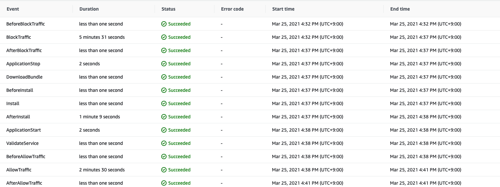
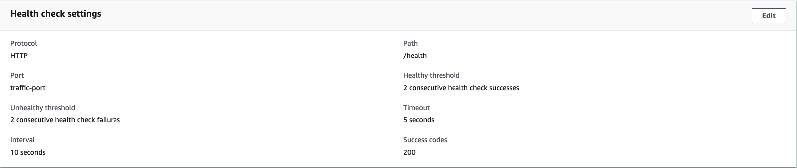
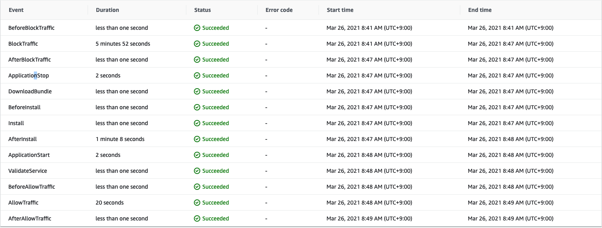
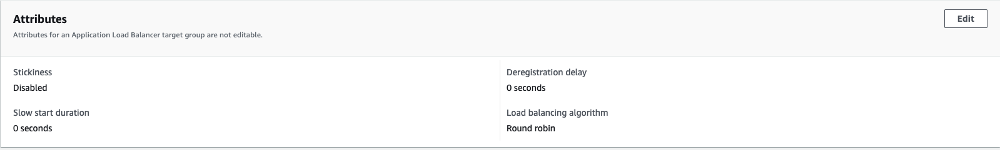
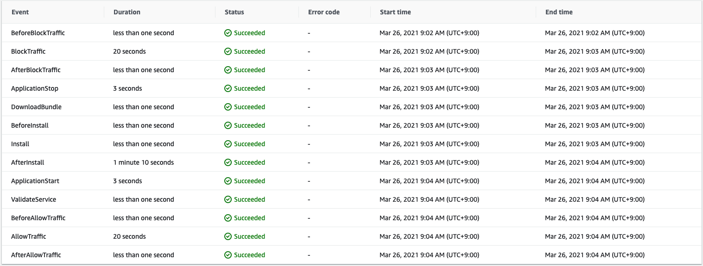

## 원인 파악

일반적으로 속도 저하가 있는 곳은 다음 사진과 같이 **BlockTraffic** 구간과 **AllowTraffic** 구간이다.

## AllowTraffic

**AllowTraffic** 구간이 느린 이유는 Target Group 에서 Health Check 할 때 상태를 체크하는데 오래 걸리기 때문이다.

**AllowTraffic** 의 Default 설정 값을 살펴보면 threshold 는 5이고 interval 은 30이다.

그래서 정확히 30 \* 5 = 2분 30 초가 걸리는 것이다.

따라서 속도를 빠르게 하기 위해선 Healthy threshold 를 **5**에서 **2**로 변경하고 interval 도 **30** 에서 **10**으로 설정해주면 된다.

그러면 AllowTraffic 값이 20초로 바뀐 것을 볼 수 있다.

## BlockTraffic

BlockTraffic 을 줄이기 위해서는 Deregistration delay 값을 낮추면 된다.

다음 사진과 같이 기본 300초에서 0으로 바꿔주자.

이렇게 바꿀 경우 BlockTraffic 에서의 소요 시간이 다음 사진과 같이 확연히 줄어든 것을 볼 수 있다.

## References

https://serverfault.com/questions/757262/is-there-a-way-to-speed-up-aws-codedeploy
