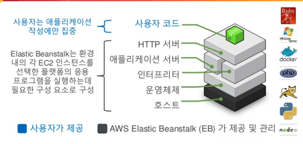

Elastic Stalk 은 웹 애플리케이션/웹 서비스를 배포하고 확장하고 관리하는데 있어 쉽고 빠르게 할 수 있도록 돕는 Fully Managed Service 다.

## 문제점

개발자들은 비즈니스 로직과 기능을 코드로 구현을 한다. 그런데 우리는 그것만 하지 않는다.

위의 것과 관련 없는, 코드의 배포 (배포 자동화), 프로비저닝, 네트워크 및 방화벽 구성, 로드밸런싱, 오토스케일링 등 여러 작업에 우리는 많은 비용을 지출해야 한다.

옜날에는 온프레미스 환경에서 이것을 직접 알아서 구축했다.

그리고 클라우드 환경이 유행하면서, 물리 서버 없이 인터넷에서 클릭 몇 번하는 것으로 쉽게 서버를 끄고 킬 수 있는 것들이 등장하고

여러 배포 자동화 툴, 네트워크 구성을 위한 서비스 (VPC), 간편하게 로드밸런싱과 오토스케일링 (Auto-scaling group, Elastic Load Balancer) 가 등장함에 따라

그나마 비용을 줄일 수 있게 된다. 물론 이것을 사용하는게 무조건 좋은 것은 아니지만 말이다.

하지만 이마저도 Learning Curve 와 설정에 대한 비용이 든다. 특히나 간단한 서비스를 만들어서 시장 반응성을 보려한 서비스에 대해서도

이런 설정들을 하는 것은 부담스러울 수 있다. 이것을들 해결해주는 것이 나왔다.

Elastic Beanstalk 은 위에서 언급한, 프로비저닝, 배포, 로드밸런싱 등 모든 과정을 한 번에 관리해주어서

Infra 에 대한 프로비저닝, 업데이트 및 배포 등을 신경쓰지 않고 기능 개발에만 집중할 수 있게 된다.

과금 체계 또한 빈스톡에 대한 추가 비용은 없고 자기가 사용한 AWS EC2, S3 에 대한 비용만 지불하면 된다.

## 관리 포인트

AWS Elastic Beanstalk 이 지원하는 기술은 다음과 같다.

- 인스턴스 및 OS 설치
- 웹어플리케이션 소프트웨어 구성
- Auto Scaling 구성
- 로드 밸런서 구성
- 업데이트 배포 및 버전 고나리
- 모니터링

## 사용 자원

Elastic Beanstalk 이 관리하며 사용하는 자원에 대해 알아보자.

- EC2 인스턴스
- Auto-Scaling Group
- Elastic Load Balancer
- Dns publising
- S3: 소스코드 관리

> 위에서도 언급했지만 우리는 위 자원을 사용한 것에 대한 비용만 내면 된다.

> 애플리케이션의 로그와 버전에 관한 설정들은 S3 에서 관리한다.

## 인프라 스택 구성

사용자는 정말 코드만 관리하면 된다는 것을 알 수 있다.

## 출처

https://www.slideshare.net/awskorea/aws-elastic-beanstalk-aws-aws-devday2018

https://yonguri.tistory.com/35
