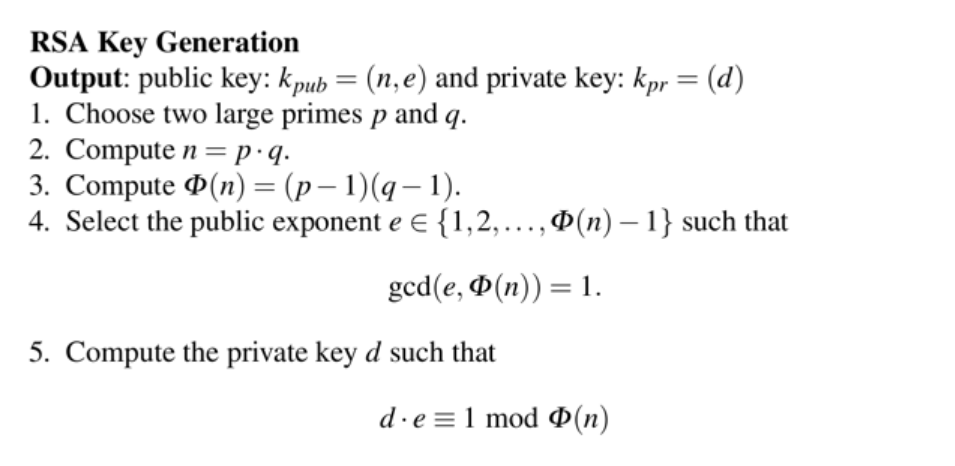

[공개키 암호화](/crpyto/공개키-암호화/)

## RSA 키 생성

1. 서로 다른 소수 p, q 를 고른다.
2. p 와 q 를 곱해서 n 을 구한다.
3. 오일러 피 함수에 해당하는 φ(N) = (p-1)(q-1)을 구한다.
4. φ(N) 보다는 작으면서 φ(N)와 서로소인 정수 e를 찾는다. (1 < e < φ(N))
5. 확장된 유클리드 호제법을 이용해 e mod φ(n) = 1인 d를 구한다.

공개키: (n, e)
개인키: d

> RSA는 공개 키를 먼저 구한 다음에 개인 키를 구한다. ECC의 경우 RSA와 반대로 개인 키를 먼저 구한 후 공개 키를 구한다.

## References

https://code13.tistory.com/272

https://m.blog.naver.com/PostView.naver?isHttpsRedirect=true&blogId=tkdgjs99&logNo=110032057061

https://rsec.kr/?p=426

https://security.stackexchange.com/questions/90169/rsa-public-key-and-private-key-lengths
