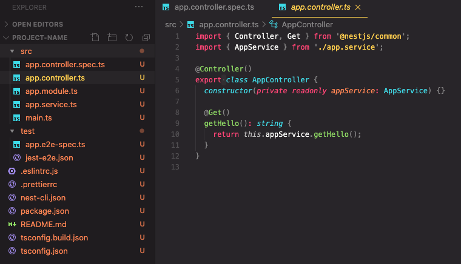
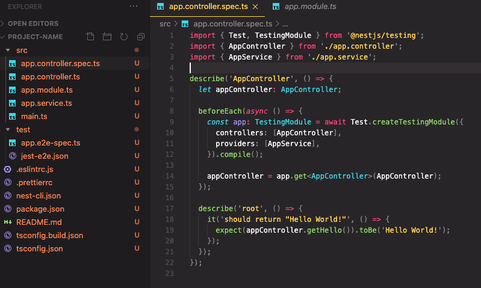
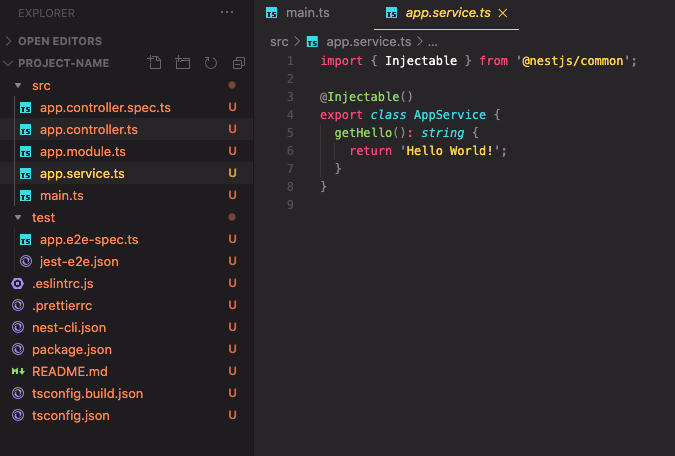
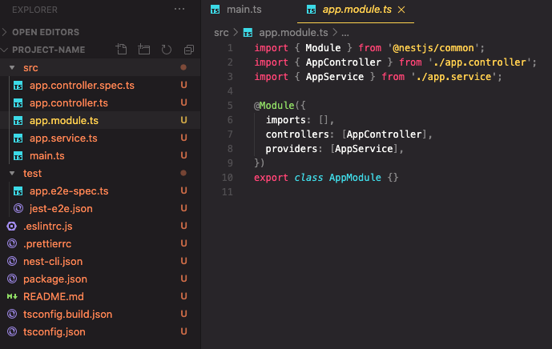

## 작성 계기

평소 Node.js 로 Server Side 를 개발하고 있는 와중 Nest.js 의 존재를 알게되고 사용해보며 좋음을 느껴 제대로 정리해보고자 함.
[공식문서](https://docs.nestjs.com/) 를 주로 참고해서 정리함.

## NestJS 란?

Nestjs 는 효율적이고 확장 가능한 Node.js Server side application 이다.

특징으로, Typescript 을 완벽히 지원하고 OOP, FP, FRP 를 지원한다.

내부적으로는 다른 HTTP Framework 를 추상화 해서 사용하고 있다.

- [Express](https://expressjs.com/)
- [Fastify](https://www.fastify.io/)

등장하게 된 계기는, Front Level 에서는 React, Vue, Angular 3대장과 같은 좋은 프레임워크가 등장했는데

Node.js 진영에서는 아키텍처를 효과적으로 해결해주는 기술이 등장하지 않아 만들어졌다고 한다.

NestJS 는 AngularJS 개발자들이 만들었따. 따라서 비슷한점이 많다.

## 시작

프로젝트 구성과 코드래벨에 대해서 아주 간단하게 알아보자.

우선 NestJS 는 CLI 를 매우 잘 지원한다.

```bash
$ npm i -g @nestjs/cli
$ nest new project-name
```

위 코드 만으로 프로젝트 구조가 생성이 된다.



Controller Boilerplate 작성이 된다.



Controller, Service Layer 에 대한 테스트코드 또한 작성이 된다.



Serviec Layer



Module

이곳에서 Dependency 를 주입해서 IOC / DI 를 구현한다.

## 기술적 지원 범위

**CLI: Boilerplate**

위에서 알아 봤듯이 편리하게 구성을 해준다.

**Architecture**

Module, Controller, Service Layer 로 구성이 된다.

**Middleware**

Middleware 를 구성하기 쉽다.

**Exception Filter**

에러 핸들링을 처리하기 쉽다.

**Pipe**

joi 나 class-validator 같은 서브파티 라이브러리를 사용해 validation 을 구성하기 쉽게 만들어져있다.

**Guard**

Annotation 을 이용해 가드를 선언해 간단하게 보안 로직을 구성할 수 있다.

**Interceptor**

인터셉터를 지원한다.

**Custom Decorator**

Java, C# 과 같은 언어처럼 Annotation 으로 개발을 편리하게 가능하게 해준다.

**Swagger**
코드 몇 줄만으로 모든 Controller 에 대한 API 문서화가 가능하다.

**그외 각종 서드파티와의 결합 지원**
Graphql, Websocket, Redis, RabbitMQ, Kafka, gRPC, Passport 등.. 수많은 서드파티와의 결합을 손쉽게 제공한다.

## Express 와 비교하며 느낀 것

Express 에 비해 NestJS 는 Framework 단에서 구성해주는 것이 많아 편리했다.

Prettier, ESLint 가 처음부터 구성되어 있는 것, 코드 구조가 잡혀 있어 유지보수에 용이해 보인점.

OOP 적으로 코드를 구성할 수 있는 것이 좋아 보였다.

그런데 그것들이 반대로 단점으로도 작용한다는게 느껴졌다. 추상화를 하긴 했지만 Express 를 Wrapping 해서 만들다보니

Nodejs 의 가벼운 느낌이 사라졌다. Java 개발하는 것과 거의 흡사하다. 그래서 Node.js 의 원래 철학과 어울리는지도 의문이긴 하다.

그럴빠엔 JAVA Spring 으로 개발하는게 낫지 않을까도 싶다.

모든 기술엔 트레이드 오프가 있다.

Express 만 이용해 Boilerplate 를 작성해 Convention 을 유지하며 통일감을 주던지, Nest.js 로 사용해 개발하던지 여러가지 방법이 있을 것 같다.
