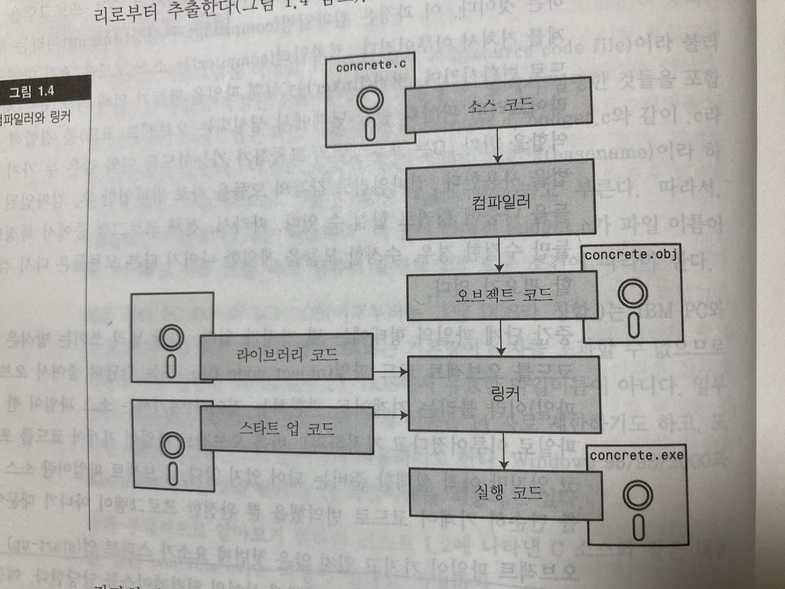

소스 코드는 인간이 이해할 수 있는 형태다. 소스 코드를 실행 가능한 파일로 만들기 위해 컴파일링과 링킹을 이라는 두 단계를 거친다.

**컴파일러**는 소스 코드를 **중간 단계의 코드**로 변환시키며, 링커는 실행 파일을 만들기 위해 **다른 코드**(시스템 라이브러리 파일과 중간 단계에서 생성되는 오브젝트 코드)를 **결합**해 주는 역할을 한다.

C는 **모듈화**가 가능하게 하기 위해 각각의 모듈을 따로 컴파일 한 후, **컴파일 된 모듈들을 링커로 합칠** 수 있다. 따라서, 전체 프로그램 중 특정한 모듈만 수정한 경우 나머지 모듈들은 다시 컴파일 할 필요가 없다.

위에서 언급한, 중간 단계의 형태 중 여러가지가 있는데, 오브젝트 코드 파일이라는 것이 있다. 오브젝트 파일은 기계어를 포함하지만 아직 완전한 프로그램이 아니기에 실행할 수 없다.

오브젝트 파일이 부족한 것 2가지가 있다.

1. 스타트 업 코드
2. 라이브러리 루틴에 대한 코드

스타트업 코드란,

컴파일러는 그 소스 코드를 오브젝트 코드로 변환한다.
프로그램과 운영체제 사이의 인터페이스를 담당한다. OS 마다 다른 스타트업 코드가 필요하다.

라이브러리 루틴에 대한 코드란,

printf() 와 같은 함수는 라이브러리에 저장이 되어있다. 라이브러리 파일에는 수많은 함수에 대한 오브젝트 코드를 포함하고 있다.
이것을 연결시켜주는 작업을 해야한다.

정리하면,

오브젝트 파일과 실행 파일 모두 기계어로 이루어져 있다. 그러나 오브젝트 파일은 사용한 코드를 단순히 기계어로 번역한 것에 불과하지만,

실행 파일은 사용된 라이브러리에 대한 기계어 코드는 물론 스타트업 코드도 포함하고 있다.

어떤 시스템에선 링커를 별로도 실행해야 하며, 어떤 시스템에선 링커를 자동으로 호출하여 실행 파일을 한 번에 만들어 준다.

## 출처

[C 기초 플러스](http://www.yes24.com/Product/Goods/57614028)
