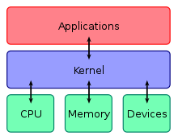

## OS

---

운영체제는 하드웨어를 관리한다.

### 목적

- 성능 향상
  MsDos 랑 Windows7 과 속도는 천지차이다.
  어떻게 성능을 올릴 수 있을까?
- 사용자 편의성
  누구든지 학습해서 사용할 수 있다.

### Main Memory

- Ram 과 Rom 으로 나누어진다.
- Ram은 휘발성이다.
- Rom (Read only memory)은 휘발성이 아니다.
- Rom 은 용량이 작고, 대부분 Ram 이 용량을 차지한다.

### Rom

부팅 시 Rom 의 코드(Instruction)를 먼저 읽어온다.

Rom 에 있는 프로그램에 대해 알아보자

- **POST** (Power-On Self-Test)
  환경 설정을 테스트한다.
  메인 메모리와 하드디스크 용량, 키보드, 마우스 꽂힘 여부 같은 것을 확인한다.
- **Boot Load** (적재)
  OS 를 하드 디스크에서 찾아 Main Memory 의 Ram 영역에 전달한다.
  이때 OS 가 Main Memory 에 올라온다.
- 그 후로는 실행될게 없어서 역할이 끝난다.

OS 가 메인 메모리에 올라오면 화면이 나타날 것이다.

OS 는 다른 프로세스와 다르게, 전기를 끄지 않는 이상 Main Memory 에 항상 **상주(Resident)**한다.

### 구조

OS 에서 하드웨어를 관리하는 것은 OS Kernal 이다. (가장 중요)

OS = kernel + shell

우리가 보는 것은 shell 밖에 없다.

OS: **Process Management, Memory Management**, IO Management, File Management, Network Management

## 정리

---

OS 는 시스템의 성능을 향상시키고 사용자 편의성을 증가 시킨다. Main Memory 는 대부분의 용량을 차지하는 Ram 과 적은 용량을 차지하는 Rom 이 있다. 컴퓨터가 켜질 때, 이 Rom 에서 POST 라는 작업을 실행함으로써 Main Memory, Disk Storage, Keyboard 같은 것을 테스트 한다. 그리고나서 Boot Load 를 통해 OS 를 하드 디스크에서 찾아 Main Memory 의 Ram 에 적재 시킨다. 이후로는 할 일이 없어서 역할이 끝난다. OS 는 Main Memory 에 항상 상주한다.
