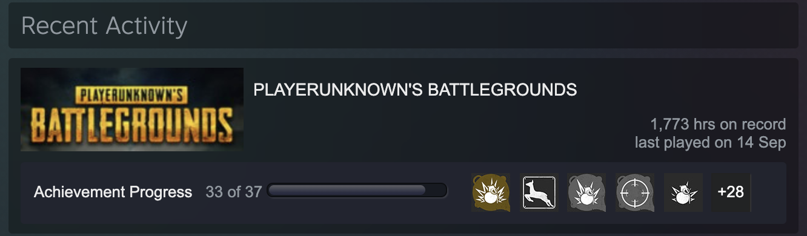

회고라는 것을 블로그에 처음 써 본다. 지금까지는 남들이 쓰는 것을 보고 대단하다고 생각하고, 읽으면 같이 무언가를 느낄 수 있었다. 사실 나 혼자만의 일기를 매일 아날로그에 쓰기는 하지만, 매달 어떤 의미를 두고 쓰지는 않았었다. 근대 이게 쌓이고 쌓이다보면 매달 매달 나의 생각을 쭉 보면 기분이 좋을 것 같다.

결심이란걸 하지 않았기 때문에 특별히 이번 달을 평가하거나 그럴게 없다. 사실 난 매 새해마다 무언갈 결심하거나, 매달 결심을 해본 적이 없는 것 같다. 왜냐면 그렇지 않아도 평소에 수시로 많은 결심들을 하기 때문에 그런 것 같다. 이번 달부터는 매달의 결심을 한 번 적어보자. 그리고 다음달 회고에서 그걸 회고해보는 것이다.

## 10월 회고

요즘 시간이 너무 빨리 가서, 무슨 달에 뭘 했는지 잘 기억이 안 난다. 그래도 나름 잘했다고 생각하는 점이 있다.

9월 쯤에 결심한, 매일 일기 쓰기를 거의 10월달 동안 매일매일 썼다는 것이다. 그 일기에는 명언쓰기, 내가 되고싶은 사람, 결심, 내 생각 같은 것을 정리하곤 했다.

근대 일기에 맘에 드는 명언 5개씩 1달을 넘게 쓰다보니, 더이상 맘에드는 것이 잘 보이지 않아, 잠시 쓰는 것을 멈췄다.

일기를 쓰며 내 결심, 공부할 것들을 적는 것은 참 좋은 것 같다. 꾸준히 자신의 목표를 잊지 않고 열심히 살 수 있기 때문이다.

그리고 자신이 할 일을 적으며 행하는 것과 적지 않으며 하는 것은 큰 차이가 있다는 연구 결과를 본 기억이 있다.

그리고 가장 뿌듯한 것은 **게임을 탈출** 했다는 것이다.

마지막 플레이 타임이 9월 14일이고, 10월 달이 끝났으니 거진 게임은 끝난 것 같다.

## 11월 결심

- 잠자는 패턴 일정화 하기.
- 운동 꾸준히 하기.

잠자는 패턴이 일정하지 않아서 요즘 좀 스스로에게 불만이다.

그리고 운동을 꾸준히 안 하니, 몸이 안 좋아진게 느껴진다. 열심히 해야겠다.

난 이 2개만 해도 아깝지 않고 알찬, 11월이 될거라고 생각한다.

이번 년도를 마무리하기 위한 11월달을 잘 보내보자.
