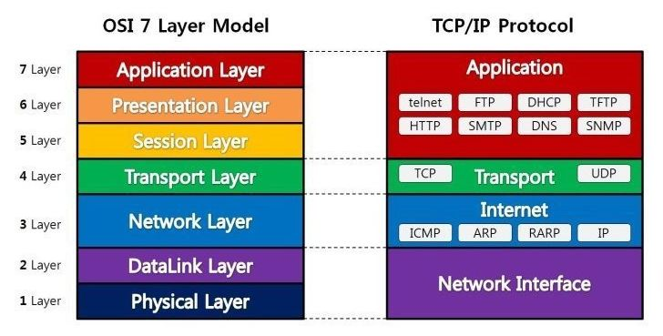

## HTTP

HTTP 프로토콜은 TCP/IP 프로토콜 위의 레이어인 Application Layer 에서 동작한다.

### Stateless

HTTP 프로토콜은 stateless 프로토콜이다. 각각의 데이터 요청이 서로 독립적으로 관리되어, 이전의 요청과 다음 요청이 서로 관련이 없다.

## HTTP/1.1

연결당 하나의 Request과 Response를 처리하기 때문에 동시전송 문제와 다수의 리소스를 처리하기에 속도 및 성능 이슈가 있다.

대표적인 문제는 다음과 같다.

### 1. HOLB(Head Of Line Blocking) - 특정 응답 지연

Web 환경에서 HLOB는 두 종류가 있다.

- HTTP의 HOLB
- TCP의 HOLB

HTTP HOLB에 대해 알아보면

Connection당 하나의 Request 를 처리하는 문제를 해결하기 위해 Pipelining이 제안이 되었다.

pipelining 예시는 다음과 같다.

그런데 아래 같은 문제가 발생할 수 있다.

하나의 리소스가 병목현상이 될 수 있다. 이것이 pipelining 의 문제점 중 하나인 HOLB이다.

### 2. Round Trip Time 증가

→ tcp 커넥션으로 인한 오버헤드

HTTP/1.1 특징상 하나의 connection 마다 tcp 연결을 하여, tcp 의 특징인 신뢰성 연결을 위해 시작 시 3-way-handshake, 종료 시 4-way-handshake가 반복적으로 발생하여, 이로인한 오버헤드가 있다.

### 3. Heavy header

HTTP/1.1의 header에는 많은 metadata가 저장되어 있다. 사용자가 방문한 웹사이트에서는 다수의 HTTP Request 가 발생하는데 이때마다 중복된 header값을 전송하며, 특히 cookie 가 큰 문제이다.

## HTTP/2.0

- Multiplexed Streams: 한 connection으로 동시에 여러개 메시지를 주고 받을 수 있으며, 응답은 순서에 상관없이 stream으로 주고 받는다.
- Stream Prioritization: 리소스간 우선순위를 설정해 클라이언트가 먼저 필요한 리소스부터 보내준다.
- Server Push
- Header Compression: Header table과 Huffman Encoding 기법을 이용해 압축한다.

## 출처

https://chacha95.github.io/2020-06-15-gRPC1/

https://www.popit.kr/%EB%82%98%EB%A7%8C-%EB%AA%A8%EB%A5%B4%EA%B3%A0-%EC%9E%88%EB%8D%98-http2/
