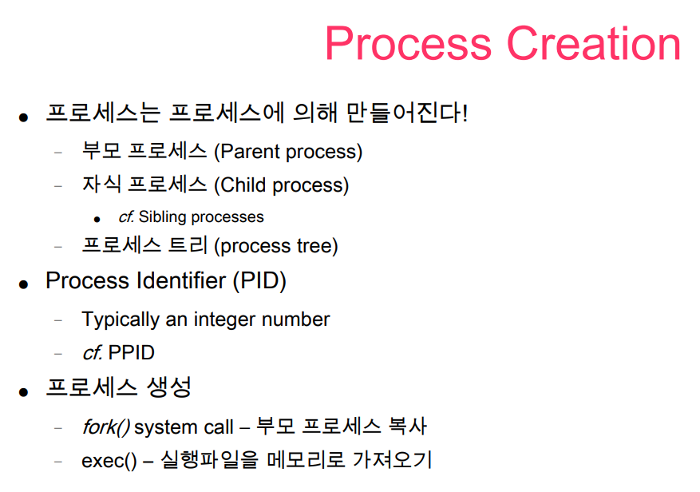
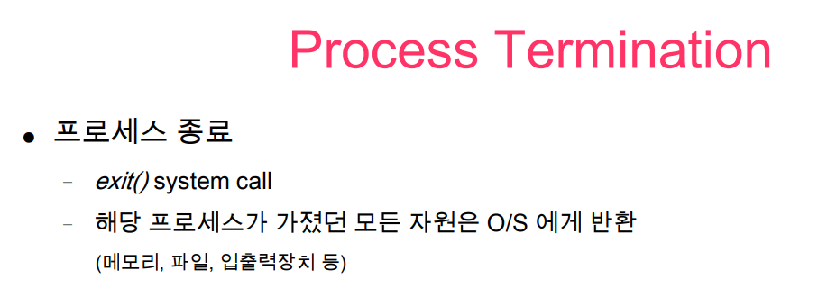

최초의 부모는 Memory에 OS가 올라갈 때 생성된다.

부모의 PID 는 PPID 라고도 한다.

부모가 같은 자식 프로세스들은 Sibling Process 라고 한다.

프로세스가 만들어지면 실행 파일이 그 프로세스에 복사 된다. (exec())

## 출처

http://www.kocw.net/home/search/kemView.do?kemId=978503
