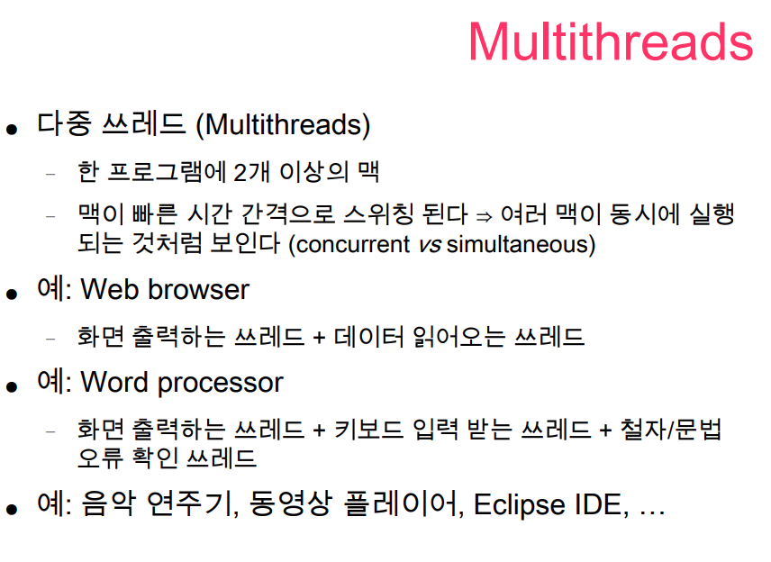
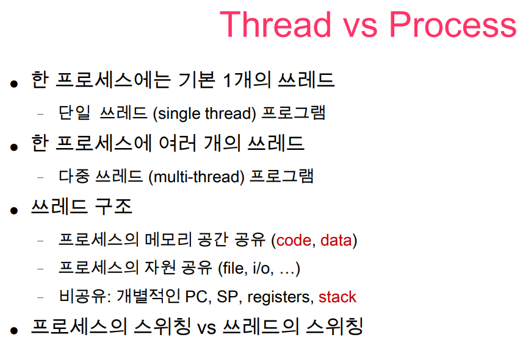

Thread 도 Process의 시분할처럼 여러 번 스위칭되어서 동시에 동작하는 것처럼 보인다.

현대 프로그램은 대부분 Multi Thread 프로그램이다.

PC 는 공유하지 않는다. 서로 실행하는 위치를 같게하면 문제가 생기기 때문이다.

그래서 Process의 스케쥴링과 함께 살펴보자. P1, P2, P3 가 있고 각각의 프로세스에는 A, B, C 라는 세 개의 프로세스가 돈다고 생각해보자.

처음에는 P1이 실행되고 P1 안에 있는 A thread 돌고, B thread 돌고, C thread 돌다가 퀀텀이 지나면 슈케줄링이 일어나서 P2 가 실행이 되는데 이때도 마찬가지로 Thread 들이 돌아가면서 실행될 것이다. 따라서 프로세스도 스위칭이 일어나고 그 프로세스 안에 있는 쓰레드도 스위칭이 일어난다고 할 수 있다.
