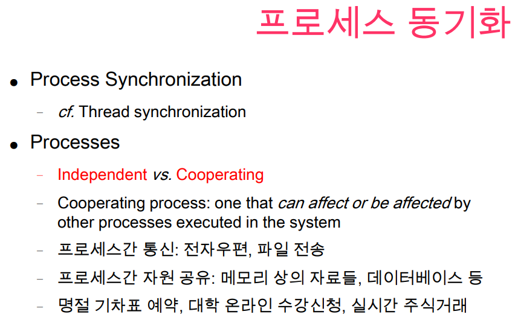
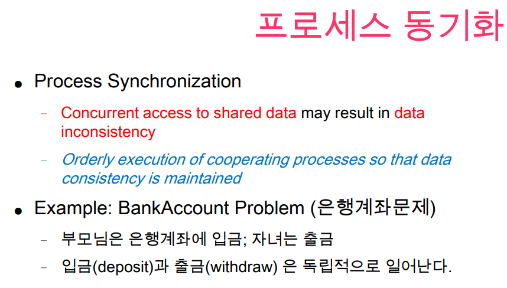

협력이 이루어지는 프로세스를 Cooperating, 혼자서만 작동하는 프로세스를 Independent 한 프로세스라고 한다.

현대 애플리케이션은 대부분 Cooperating Process 들이 많다.

프로세스간 통신을 위해 Message 를 주고 받는 형태로 통신이 된다.

프로세스간 통신이 일어나다보면 동시성 문제가 발생할 수 있어서 해당 문제를 해결하는 것은 중요하다.

